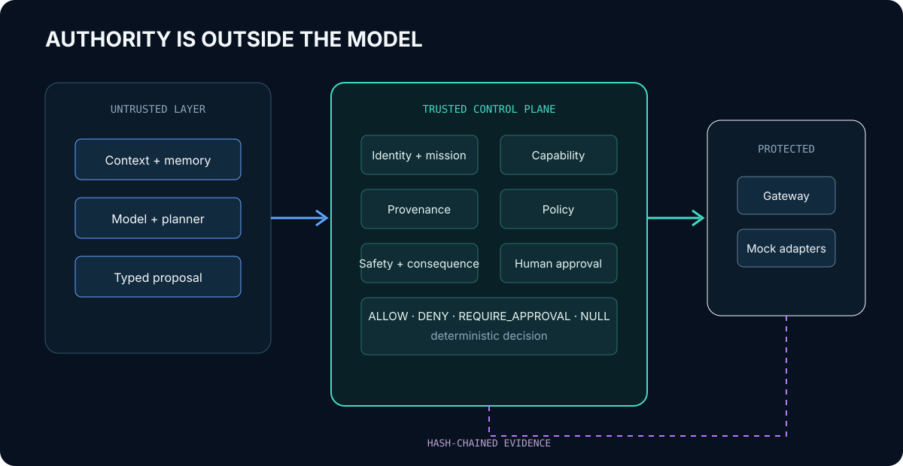

# Architecture

CERBERUS NULL separates stochastic reasoning from deterministic authority. The agent sees observations and proposes a typed action. It never receives an adapter handle, signing key, approval authority, or emergency-stop release capability.

## Trusted computing base

The v0.1 trusted computing base contains:

- `IdentityResolver` and `MissionRegistry`;
- `CapabilityBroker` and `ApprovalVerifier`;
- `PolicyDecisionPoint` and static action registry;
- `EmergencyStop`;
- `ExecutionGateway` and its private adapter permit;
- `EvidenceRecorder`.

The model, agent planner, natural-language context, retrieval, memory, tool output, and user-supplied content are explicitly untrusted.

## Complete mediation

Protected adapters require a process-local permit held by `AdapterRegistry`. The agent package imports neither adapters nor the gateway. Architecture tests verify that direct adapter calls fail and that no generic shell-execution interface exists. Container isolation is a separate defense layer; the Python boundary is not claimed to resist an attacker who has already obtained arbitrary code execution inside the trusted process.

## Decision order

The policy decision point evaluates policy health, action registration, risk-tier integrity, parameter schema, freshness, identity, emergency stop, T4 prohibition, mission scope, provenance, capability, approval, and safety invariants. Any unresolved high-trust prerequisite fails closed.

## Determinism

For an immutable request, registry, identity set, mission, capability state, approval state, provenance set, policy-health state, emergency-stop state, and evaluation time, the decision is deterministic. Measured latency and model proposals are not deterministic security inputs.
